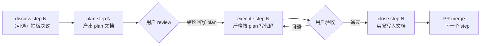

# claude-workflow

Claude Code 项目工作流脚手架：**Discuss（可选）→ Plan → Execute → Close** 四阶段循环。

源自一个 10 周 / 26 step / 137 commit 的生产项目（Electron + FastAPI 桌面应用，OCR / 本地 LLM / 模型训练三类重集成）的完整实践，并按实践教训做了系统性修订：plan 不写实现代码、契约只留索引、文档按域拆分防膨胀、阶段纪律由 hooks 确定性强制。

## 核心理念

- **每个 step 从干净 context 开始，阶段间按 step 大小切分会话**——大 step 分会话（探索噪音不跨阶段），小 step 可同会话连跑；底线是 execute 的权威输入永远是 plan 文件而非对话记忆
- **Plan 描述行为与契约，不写实现代码**——plan 里的代码在 execute 时必然过期，还白耗两遍 context
- **「范围外」与「不要做的事」和「范围内」同等重要**——防越界是这套流程的核心价值
- **文档以实际代码为准**：代码能回答的问题不进文档；文档只存决策理由、被推翻的假设、edge case 行为、实测结论、跨 step 承诺
- **读取成本不随项目增长**：PROGRESS 最新置顶只读最近几条；PIPELINE 薄核心 + 按域拆分；契约一行一条索引
- **ADR 只增不删**，被推翻的决策用删除线保留——错误结论也是资产
- **阶段纪律由 hooks 确定性强制**，不止靠模型自律

## 快速开始

### 新项目

1. GitHub 上点 **Use this template**（或 clone 后删 `.git` 重新 `git init`）
2. 在 Claude Code 中输入 `bootstrap`，回答项目参数问题——Claude 会实例化全部 planning 文档、按技术栈生成 CI、产出 Step 0 plan
3. Review step 拆分草案与 Step 0 plan
4. 之后每个 step 循环：

```text
discuss step N   （可选：大 step 先逐项拍板，产出决议清单）
plan step N      → review plan（结论回写 plan 文件）
execute step N   → 验收
close step N     → 实况写入文档 → merge PR

hotfix <描述>    （小改动快速通道：typo / 一行修复 / 依赖 bump，不走四阶段）
```

### 已有项目

把 `.claude/`、`docs/planning/`、`CLAUDE.md` 复制进项目，跑 `bootstrap`（会读取现状后实例化文档）。若项目已有 `CLAUDE.md` 或 `.claude/settings.json`，**合并而非覆盖**——settings.json 已有 hooks 时，把本脚手架的 PreToolUse / SessionStart 条目手动并入既有 hooks 数组。

## 四阶段

| 阶段 | 触发语 | 产出 | 纪律（hooks 强制） |
|---|---|---|---|
| Discuss（可选） | `discuss step N` | `STEPS/STEP_NN_discuss.md` 决议清单 | 只能写 `docs/planning/` |
| Plan | `plan step N` | `STEPS/STEP_NN_plan.md` | 只能写 `docs/planning/` |
| Execute | `execute step N` | 代码 + 测试 + 验收自检 | **禁止**写 `docs/planning/` |
| Close | `close step N` | PIPELINE 索引 / 域文件 / PROGRESS / ARCHITECTURE 更新 + PR | 只能写 `docs/planning/` |



### 小改动快速通道（hotfix）

typo / 一行修复 / 依赖 bump 不必套四阶段仪式：`hotfix <描述>`。判据：≤3 文件量级、不碰接口契约 / DB schema / 新依赖，不满足则升级为正式 step。影响行为的修复在 PROGRESS「杂项」节留一行记录——防止体系外改动造成记忆漂移。

### Session 策略

小 step 可 plan → execute → close 同会话连跑（review 结论仍须回写 plan 文件、close 仍须对 git diff 审计而非凭记忆）；大 step 阶段间开新会话或 `/clear`。底线：execute 的权威输入是 plan 文件，不是 plan 对话。

## 目录结构

```text
.
├── CLAUDE.md                        # 项目指令：触发语 → skill 映射、文档结构、git 约定
├── .claude/
│   ├── settings.json                # hooks 配置（PreToolUse + SessionStart）
│   ├── hooks/
│   │   ├── phase-guard.js           # 阶段纪律守卫（按阶段拦截越界写入）
│   │   ├── phase-guard.test.js      # 守卫自测（node 运行，10 用例）
│   │   └── clear-phase.js           # 新会话启动自动清残留阶段标记
│   └── skills/
│       ├── bootstrap/               # 项目启动：实例化文档 + Step 0 plan
│       ├── discuss-step/            # 可选第 0 阶段：逐项拍板
│       ├── plan-step/               # 生成 step plan
│       ├── execute-step/            # 按 plan 写代码
│       ├── close-step/              # 实况写入文档 + 收尾
│       └── hotfix/                  # 小改动快速通道
├── docs/planning/
│   ├── ARCHITECTURE.md              # 技术栈 + ADR + 代码规范（稳定文档）
│   ├── PIPELINE.md                  # 薄核心：概念 / step 拆分 / schema / 契约索引 / 决议台账
│   ├── pipeline/                    # 按域拆分的行为详细参考（Close 阶段维护）
│   ├── STEPS/                       # 每个 step 的 plan 与 discuss 存档
│   └── PROGRESS.md                  # step 实录（最新置顶，每 10 条归档）
└── .github/ci.yml.example           # CI 模板（bootstrap 实例化为 workflows/ci.yml）
```

## 阶段纪律（hooks）

各阶段 skill 把阶段名写入 `.claude/workflow-phase`；`phase-guard.js` 在每次 Write/Edit 前检查，越界写入直接拒绝并说明原因。阶段正常结束时 skill 清除标记；异常中断残留的标记由 SessionStart hook（`clear-phase.js`）在下次新会话启动时自动清除（resume 续会话不清）。仍遇误拦时手动 `rm .claude/workflow-phase`。

hook 只拦 Write/Edit 类工具，Bash 改文件属于自律范围（各 skill 禁止事项已点名）。改动 hook 后跑 `node .claude/hooks/phase-guard.test.js` 自测（10 用例断言退出码）。

不想要 hooks：删除 `.claude/settings.json` 中的 `hooks` 段与 `.claude/hooks/` 目录，纪律退化为 skill 文本约束。

## 文档体系与防膨胀

长周期项目的文档会吃掉 context，这套体系的对策：

1. **PIPELINE.md 只做薄核心**，各子系统的行为参考拆到 `pipeline/<domain>.md`，会话按需读取
2. **契约只留索引**（一行：用途 + 实现位置 + step），签名细节以代码为准——消灭「文档抄代码」的维护负担与漂移风险
3. **PROGRESS.md 最新置顶**，日常只读最近 2-3 条；超 10 条归档
4. **收录原则**：代码能回答的不进文档

## 定制

- `CLAUDE.md`：语言、git 约定按团队习惯改
- `skills/*/SKILL.md`：各阶段步骤可按项目形态微调（如层推进顺序、验收要求）
- `docs/planning/*.md`：骨架中的 `<!-- bootstrap -->` 注释标明了需实例化的位置，`bootstrap` skill 会自动处理

## License

MIT
