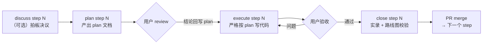

# claude-workflow

Claude Code 项目工作流脚手架：**Discuss（可选）→ Plan → Execute → Close** 四阶段循环，配 hotfix 与 roadmap 两条快速通道。

源自一个 10 周 / 26 step / 137 commit 的生产项目（Electron + FastAPI 桌面应用，OCR / 本地 LLM / 模型训练三类重集成）的完整实践，并按实践教训做了系统性修订：plan 不写实现代码、契约只留索引、文档按域拆分防膨胀、阶段纪律由 hooks 确定性强制。目标场景：中大型项目起步时搭好架子，把项目拆成线性的 step，step 之间把握大方向不跑偏。

## 核心理念

- **每个 step 从干净 context 开始，阶段间按 step 大小切分会话**——大 step 分会话（探索噪音不跨阶段），小 step 可同会话连跑；底线是 execute 的权威输入永远是 plan 文件而非对话记忆
- **Plan 描述行为与契约，不写实现代码**——plan 里的代码在 execute 时必然过期，还白耗两遍 context
- **「范围外」与「不要做的事」和「范围内」同等重要**——防越界是这套流程的核心价值
- **路线图是活文档**——Close 校验、Plan 对齐闸门、`/roadmap` 三个入口都能改它，同一套记录规则；大方向靠每个 step 刷新一次，而不是 bootstrap 时定死
- **文档以实际代码为准**：代码能回答的问题不进文档；文档只存决策理由、被推翻的假设、edge case 行为、实测结论、跨 step 承诺
- **读取成本不随项目增长**：PIPELINE 体量恒定，随 step 增长的内容进域文件与每 step 一个的实录文件；各阶段只定位读取自己需要的段落
- **Close 记账不对账**：Execute 的 commit 正文固定写偏离 / 临场决策 / 遗留 / 验收，Close 以它和 plan 的「文档待更新」为输入定点更新，不重读 diff 和代码
- **ADR 只增不删**，被推翻的决策用删除线保留——错误结论也是资产
- **阶段纪律由 hooks 确定性强制**，不止靠模型自律——Write/Edit 与 Bash/PowerShell 写入都拦，命令执行后再用 git status 兜底审计
- **任务清单只当里程碑用**——execute 的执行顺序、discuss 的待决问题建成 todo tracker；其他阶段不建，清单也不代表剩余时间
- **项目记忆只有一个真相源**：`docs/planning/` 进 git、被 Close 阶段审计；Claude Code 的 auto memory 只放个人偏好与环境怪癖
- **汇报用产品语言**——给用户看的进展与总结只讲实现了什么、用户能看到什么、哪里和之前不一样；技术细节进 commit 正文与 planning 文档

## 快速开始

### 新项目

1. GitHub 上点 **Use this template**（或 clone 后删 `.git` 重新 `git init`）
2. 在 Claude Code 中输入 `/bootstrap`，回答项目参数问题——Claude 会实例化全部 planning 文档、按技术栈生成代码规范 rules 与 CI、产出 Step 0 plan
3. Review step 路线图草案与 Step 0 plan
4. 之后每个 step 循环：

```text
/discuss-step N      （可选：大 step 先逐项拍板，产出决议清单）
/plan-step N         → review plan（结论回写 plan 文件）
/execute-step N      → 验收（分段 plan：/execute-step N P1、P2…，每段新 session）
/close-step N        → 实况写入文档、路线图校验 → merge PR

/hotfix <描述>       （小改动：typo / 一行修复 / 依赖 bump，不走四阶段）
/roadmap <变更描述>  （新需求 / 砍功能 / 合并拆分 step / 调顺序，只改路线图）
```

斜杠形式是确定性调用，step 号与段号在 skill 载入时由 Claude Code 替换；自然语言形式（`plan step 3`）同样有效。两种都可以在后面追加补充说明。

**版本要求**：Claude Code 2.1.198 及以上（skill frontmatter 的 `when_to_use` / `arguments`、path-scoped rules、skill 占位符）。任务清单工具在 2.1.233 起的新模型上默认关闭，`.claude/settings.json` 已通过 `env.CLAUDE_CODE_ENABLE_TODO_TOOLS=1` 重新打开。

### 已有项目

把 `.claude/`、`docs/planning/`、`CLAUDE.md` 复制进项目，跑 `/bootstrap`（会读取现状后实例化文档）。若项目已有 `CLAUDE.md` 或 `.claude/settings.json`，**合并而非覆盖**——settings.json 已有 hooks 时，把本脚手架的 PreToolUse / PostToolUse / SessionStart 条目手动并入既有 hooks 数组，`env` 同理。`.gitignore` 需要加上 `.claude/workflow-phase*`（阶段标记与审计状态）。

### 从旧版升级

用新版合并覆盖 `.claude/` 与 `CLAUDE.md`（保留项目自己的 rules、`settings.local.json` 和 CLAUDE.md「关于本项目」一节），然后让 Claude 按本 README「文档体系与防膨胀」一节描述的新结构搬家：需求进 `REQUIREMENTS.md`，契约与表进域文件索引，PROGRESS 记录拆成各 step 实录，代码规范进 `.claude/rules/`。只搬不改写。

## 四阶段与两条通道

| 阶段 | 触发语 | 产出 | 纪律（hooks 强制） |
|---|---|---|---|
| Discuss（可选） | `/discuss-step N` | `STEPS/STEP_NN_discuss.md` 决议清单 | 只能写文档 |
| Plan | `/plan-step N` | `STEPS/STEP_NN_plan.md`；路线图对齐闸门 | 只能写文档 |
| Execute | `/execute-step N [Pk]` | 代码 + 测试 + 验收自检；commit 正文记偏离 / 临场决策 / 遗留 / 验收 | **禁止**写文档 |
| Close | `/close-step N` | 域文件索引与行为参考、决议台账、路线图校验、`STEP_NN_close.md` 实录 + PR | 只能写文档 |
| hotfix | `/hotfix <描述>` | 小改动直接提交，影响行为的记进 PROGRESS 杂项 | 无标记 |
| roadmap | `/roadmap <描述>` | 路线图变更日志 + step 条目 + 决议台账 | 只能写文档 |

「文档」= `docs/planning/` + `.claude/rules/`。


```mermaid
flowchart LR
    D["discuss step N<br/>（可选）拍板决议"] --> P["plan step N<br/>产出 plan 文档"]
    P --> R{用户 review}
    R -->|结论回写 plan| E["execute step N<br/>严格按 plan 写代码"]
    E --> V{用户验收}
    V -->|问题| E
    V -->|通过| C["close step N<br/>实录 + 路线图校验"]
    C --> M["PR merge<br/>→ 下一个 step"]
```

### 路线图怎么变

路线图（PIPELINE §2）在 bootstrap 时只是草案，之后靠三个入口保持与认知同步：Close 阶段逐条校验后续 step 的目标与范围是否仍成立；Plan 阶段发现 plan 目标超出路线图条目时，超出部分作为「路线图变更」交用户拍板而不是悄悄写进范围内；用户随时用 `/roadmap` 加需求、砍功能、合并拆分 step、调顺序。三个入口共用一套规则：变更写进变更日志并在决议台账记一条，step 编号不变、新增顺延、废弃用删除线保留，已 plan 未 execute 的 step 受影响时标「需重跑 plan」，历史存档不改。

### Session 策略

小 step 可 plan → execute → close 同会话连跑（review 结论仍须回写 plan 文件、close 仍以 commit 正文与 git diff 为准而非凭记忆）；大 step 阶段间开新会话或 `/clear`。execute 工作量单 session 装不下的超大 step，由 plan 阶段按工作量与 context window 判定后拆成 P1/P2… 执行段（plan 文件「执行分段」章节），每段新开 session 执行（`/execute-step N P1`…），段末必须是可验证的完整状态，段间交接只靠 git commit 与 plan 文件。底线：execute 的权威输入是 plan 文件，不是 plan 对话。

关于 context 预算：plan-step 的分段经验阈值按 200K 窗口校准，Fable 5.1 / Opus 5 / Sonnet 5 这类 1M 窗口的模型可以放宽，但仍以质量优先；如果你关闭了 auto compact（`autoCompactEnabled: false`），超窗即硬停，分段判定要更保守。resume 或 compact 之后 SessionStart hook 会播报当前阶段，按提示重新调用对应 skill 即可从中断处继续。

## 目录结构

```text
.
├── CLAUDE.md                        # 项目指令：触发语 → skill 映射、沟通风格、记忆分工、阶段纪律、git 约定
├── .claude/
│   ├── settings.json                # hooks 配置（PreToolUse / PostToolUse / SessionStart）+ env
│   ├── rules/
│   │   └── planning-docs.md         # path-scoped rule：docs/planning 的收录与修改原则（触碰时自动加载）
│   │                                # bootstrap 会在这里生成 backend.md / frontend.md 等代码规范 rules
│   ├── hooks/
│   │   ├── phase-guard.js           # PreToolUse：按阶段拦截越界写入（Write/Edit + Bash/PowerShell 启发式）
│   │   ├── phase-guard.test.js      # 守卫自测（node 运行，45 用例）
│   │   ├── phase-audit.js           # PostToolUse：Bash/PowerShell 之后用 git status 兜底审计
│   │   ├── phase-audit.test.js      # 审计自测（node 运行，15 用例，需要 git）
│   │   ├── clear-phase.js           # SessionStart(startup|clear)：清残留阶段标记
│   │   └── announce-phase.js        # SessionStart(resume|compact)：播报当前阶段、提示重调 skill
│   └── skills/
│       ├── bootstrap/               # 项目启动：实例化文档 + rules + Step 0 plan
│       ├── discuss-step/            # 可选第 0 阶段：逐项拍板
│       ├── plan-step/               # 生成 step plan，路线图对齐闸门
│       ├── execute-step/            # 按 plan 写代码
│       ├── close-step/              # 定点更新文档 + 路线图校验 + 实录 + PR
│       ├── hotfix/                  # 小改动快速通道
│       └── roadmap/                 # 路线图变更快速通道
├── docs/planning/
│   ├── ARCHITECTURE.md              # 核心约束 + 技术栈 + 目录结构 + ADR（稳定文档）
│   ├── REQUIREMENTS.md              # 原始需求（只在 discuss / plan 按需读）
│   ├── PIPELINE.md                  # 薄核心：核心概念 / step 路线图 / 决议台账 / 域索引（体量恒定）
│   ├── pipeline/                    # 每域一文件：契约索引 + 表索引 + 行为参考（Close 阶段维护）
│   ├── STEPS/                       # 每 step 三个文件：discuss / plan / close（实录）
│   └── PROGRESS.md                  # step 索引（一行一 step）+ hotfix log
└── .github/ci.yml.example           # CI 模板（bootstrap 实例化为 workflows/ci.yml）
```

## 阶段纪律（hooks）

各阶段 skill 把阶段名写入 `.claude/workflow-phase`，三道 hook 据此工作。「文档范围」= `docs/planning/` + `.claude/rules/`：

1. **`phase-guard.js`（PreToolUse）**：Write / Edit / NotebookEdit 按路径判断；Bash / PowerShell 从命令文本启发式提取写入目标（重定向、heredoc 首行、tee、sed -i、mv / cp / rm / touch / mkdir、git rm / mv、Set-Content / Out-File / Remove-Item 等），越界写入直接拒绝并说明原因。含变量或命令替换的路径 fail-open，但文本里出现 `docs/planning` 或 `.claude/rules` 的一律按文档处理；`git restore` / `git clean` 这类回到已提交状态的操作不算写入，这样审计要求回滚时不会被自己拦住。为什么必须拦 Bash：auto 权限模式下 Claude Code 会引导模型优先用 Bash 改文件，只拦 Write/Edit 等于没拦。
2. **`phase-audit.js`（PostToolUse）**：每次 Bash / PowerShell 之后跑 `git status`，execute 阶段文档范围内不该有未提交改动，其他阶段文档范围外不该有；发现即报告并要求立即回滚。同一组文件只报一次（状态存 `.claude/workflow-phase.audit`），既有未提交改动或构建产物不会反复刷屏。
3. **SessionStart**：`clear-phase.js` 在新会话（startup / clear）清除残留标记；`announce-phase.js` 在 resume / compact 时播报当前阶段并提示重新调用 skill——Claude Code 不会在后续 turn 重读 skill 文件，压缩后阶段指令可能已丢失。

启发式拦不住的写法（`python -c` / `node -e` 里的 fs 调用）由审计兜底，最终仍靠纪律：CLAUDE.md 的阶段纪律明确写了不得绕过。改动 hook 后跑自测：

```text
node .claude/hooks/phase-guard.test.js
node .claude/hooks/phase-audit.test.js
```

仍遇误拦时手动 `rm .claude/workflow-phase`。不想要 hooks：删除 `.claude/settings.json` 中的 `hooks` 段与 `.claude/hooks/` 目录，纪律退化为 skill 文本约束。

## 文档体系与防膨胀

长周期项目的文档会吃掉 context，这套体系的对策是让「每个 session 起步要读的东西」不随 step 数增长：

1. **PIPELINE.md 体量恒定**：只留核心概念、step 路线图、决议台账、域索引。原始需求单独放 `REQUIREMENTS.md`，只在 discuss / plan 按需读相关章节
2. **随 step 增长的内容按域拆分**：每个 `pipeline/<domain>.md` 以契约索引与表索引开头（一行一条：用途 + 实现位置 + step，签名与 schema 以代码为准），其后是行为参考；哪个 step 碰哪个域就读哪个文件
3. **每 step 一个实录文件**：`STEPS/STEP_NN_close.md` 记实际完成、偏离、关键决策、遗留、路线图校验；`PROGRESS.md` 只是一行一 step 的索引，永远不需要归档
4. **代码规范是 path-scoped rules**：bootstrap 把代码规范与前端设计规范按层写进 `.claude/rules/<layer>.md`，触碰对应文件时自动加载，其他会话不付这笔 context
5. **各阶段只读自己需要的**：plan 读路线图条目、相关域文件、最近 1-2 个实录；execute 读 plan 与相关域文件；close 只读 plan 的「文档待更新」、commit 正文、`git diff --stat`；hotfix 什么都不预读
6. **收录原则**：代码能回答的不进文档——写进 `.claude/rules/planning-docs.md`，只在触碰 `docs/planning/` 时加载
7. **auto memory 不存项目事实**：CLAUDE.md「记忆分工」把 step 决策、契约、进度限定在 `docs/planning/`，避免个人 memory 变成第二个漂移的真相源

## 与 Claude Code 内建能力的配合

- **`/code-review`**：execute-step 在末段验收后建议 `/code-review high origin/main...HEAD`（后台 subagent 运行，不占会话 context）。不要用 `--fix`：它的修改在会话 checkpoint 之外、`/rewind` 撤不掉，也绕过 execute 的分流规则。触及鉴权 / 数据访问的 step，close-step 建 PR 前提示 `/security-review`（只报告不改代码）。
- **subagent**：execute 的大规模机械改造用 `fork` 类型并行分组（继承 plan 与已读代码）。
- **不适合的**：阶段 skill 不要加 `context: fork`（它们需要与用户交互）；不要用 skill frontmatter 的 `hooks` 取代标记文件（skill hook 在整个 session 持续生效，同会话连跑 plan → execute 会叠加相反规则）；不要给阶段 skill 设 `disable-model-invocation`（会让自然语言触发失效）。

## 定制

- `CLAUDE.md`：语言、git 约定按团队习惯改；沟通风格默认按产品负责人视角汇报、不列技术细节，想在汇报里看到文件清单或技术方案就改这一节
- `skills/*/SKILL.md`：各阶段步骤可按项目形态微调（如层推进顺序、验收要求）
- `docs/planning/*.md`：骨架中的 `<!-- bootstrap -->` 注释标明了需实例化的位置，`bootstrap` skill 会自动处理
- `.claude/settings.json`：不想恢复任务清单工具就删掉 `env.CLAUDE_CODE_ENABLE_TODO_TOOLS`（skill 会退化为文字清单）；commit / PR 的 Claude 署名与 session 链接通过 Claude Code 的 `attribution` 设置控制（保留 session 链接便于从 commit 回溯会话）

## License

MIT
