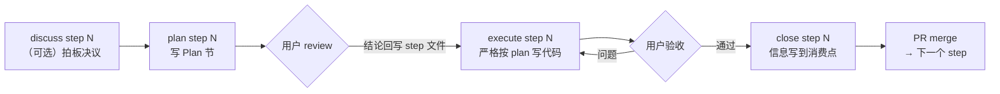

# claude-workflow

Claude Code 项目工作流脚手架：**Discuss（可选）→ Plan → Execute → Close** 四阶段循环，配 hotfix 与 roadmap 两条快速通道。

源自一个 10 周 / 26 step / 137 commit 的生产项目（Electron + FastAPI 桌面应用，OCR / 本地 LLM / 模型训练三类重集成）的完整实践，并按实践教训做了系统性修订：plan 不写实现代码、文档只写当前状态、信息写到消费点、阶段纪律由 hooks 确定性强制。目标场景：中大型项目起步时搭好架子，把项目拆成线性的 step，step 之间把握大方向不跑偏。

## 核心理念

- **一份给人看，其余给 Claude**：用户只需要打开 `OVERVIEW.md`，它永远短、永远是当前状态；其他文档是 Claude 的记忆，用户不用看
- **Claude 先看全局，再逐层深入**：ARCHITECTURE 随根 CLAUDE.md 在每个 session 启动时自动加载，其中的系统地图一眼看全所有功能在哪、负责什么、依赖谁；进入某个功能的代码时，该功能的域笔记再自动加载
- **知识先放进代码**：代码只有 Claude 读，所以类型、命名、测试名和少量注释承担大部分说明，放不进代码的才写文档
- **文档只写当前状态**：决定被推翻就改写，不留删除线；过程与理由在 step 实录和 commit 正文，历史交给 git
- **信息写到消费点**：给后续 step 的提示写进那个 step 的路线图条目，功能知识写进功能目录，后续 session 不翻历史
- **读取成本不随项目增长**：启动时只带固定上限的全局文档，plan 只读本 step 的路线图条目和相关代码，历史 step 文件没有人读
- **Plan 描述行为与契约，不写实现代码**；「范围外」和「范围内」同等重要，防越界是这套流程的核心价值
- **Execute 的权威输入是 step 文件，不是对话**；每个 step 从干净 context 开始，大 step 阶段间开新会话
- **阶段纪律由 hooks 确定性强制**，不止靠模型自律
- **汇报用产品语言**：进展与总结只讲用户能看到什么；技术细节进 commit 正文与给 Claude 的文档

## 快速开始

### 新项目

1. GitHub 上点 **Use this template**（或 clone 后删 `.git` 重新 `git init`）
2. 在 Claude Code 中输入 `/bootstrap`，回答项目参数问题：Claude 会实例化 OVERVIEW 与 ARCHITECTURE、按技术栈生成代码规范 rules 与 CI、产出 Step 0 plan
3. Review 路线图草案与 Step 0 plan
4. 之后每个 step 循环：

```text
/discuss-step N      （可选：大 step 先逐项拍板）
/plan-step N         → review plan（结论回写 step 文件）
/execute-step N      → 验收（分段 plan：/execute-step N P1、P2…，每段新 session）
/close-step N        → 信息写到消费点、路线图校验、实录 → merge PR

/hotfix <描述>       （小改动：typo / 一行修复 / 依赖 bump，不走四阶段）
/roadmap <变更描述>  （新需求 / 砍功能 / 合并拆分 step / 调顺序）
```

斜杠形式是确定性调用，自然语言形式（`plan step 3`）同样有效，两种都可以在后面追加补充说明。

**版本要求**：Claude Code 2.1.198 及以上（skill frontmatter 的 `when_to_use` / `arguments`、path-scoped rules、skill 占位符）。任务清单工具在 2.1.233 起的新模型上默认关闭，`.claude/settings.json` 已通过 `env.CLAUDE_CODE_ENABLE_TODO_TOOLS=1` 重新打开。

### 已有项目

把 `.claude/`、`docs/planning/`、`CLAUDE.md` 复制进项目，跑 `/bootstrap`（会读取现状后实例化文档）。已有 `CLAUDE.md` 或 `.claude/settings.json` 时**合并而非覆盖**：把本脚手架的 PreToolUse / PostToolUse / SessionStart 条目并入既有 hooks 数组，`env` 同理。`.gitignore` 加上 `.claude/workflow-phase*`。如果设置了 `claudeMdExcludes`，不要排除功能目录下的 CLAUDE.md，否则域笔记不会自动加载。

### 从旧版升级

用新版覆盖 `.claude/hooks/`、`.claude/skills/`、`.claude/rules/planning-docs.md` 与 `CLAUDE.md` 的工作流章节，包括末尾导入 ARCHITECTURE 的一节（保留项目自己的 rules、`settings.local.json` 和「关于本项目」），然后开一个新会话，让 Claude 按下面的清单搬家，单独一个 PR：

1. `STEPS/STEP_NN_{discuss,plan,close}.md` 按 step 合并成 `STEPS/NN-<slug>.md`，依次放决议、Plan、实录三节，内容原样搬，不改写
2. `PROGRESS.md` 的 step 索引变成 OVERVIEW「已完成」表；hotfix log 删除，git log 里有
3. 每个 `domains/<domain>.md`：删掉契约索引和表索引；决议与行为参考改写成当前状态，去掉删除线和被推翻的原文，放进对应功能目录的 `CLAUDE.md`；按层分目录的项目改写成 `.claude/rules/<feature>.md`，并在 ARCHITECTURE「目录结构」注明；在 ARCHITECTURE「系统地图」为该功能加一行，写目录、技术职责、依赖；在 OVERVIEW「已有功能」为它写两三句产品语言，不写目录
4. OVERVIEW：核心概念移到 ARCHITECTURE；路线图变更日志删除；决议台账里未决的进「待决」，已决的写进 ARCHITECTURE 架构规则或域笔记，被推翻的删除；实录里仍未处理的遗留写进目标 step 条目的「前置提示」
5. ARCHITECTURE 的 ADR 改为「架构规则」：删掉删除线条目，被推翻的只留新结论；目录结构只留顶层与分层惯例；整份压到约 200 行以内，它每个 session 都会加载
6. 项目已有的各层代码规范 `.claude/rules/<layer>.md` 补上「注释与测试」一节，内容照 bootstrap skill 第四步
7. 删除 `PROGRESS.md`、`domains/`、`STEPS/README.md`

第 3 到 5 步是改写，让 Claude 在 commit 正文列出删除与合并清单，审这份清单即可。

## 四阶段与两条通道

| 阶段 | 触发语 | 产出 | 纪律（hooks 强制） |
|---|---|---|---|
| Discuss（可选） | `/discuss-step N` | step 文件「决议」节 | 只能写文档 |
| Plan | `/plan-step N` | step 文件「Plan」节；路线图对齐闸门 | 只能写文档 |
| Execute | `/execute-step N [Pk]` | 代码 + 测试 + 域笔记；commit 正文记偏离 / 临场决策 / 遗留 / 验收 | **禁止**写 planning 文档 |
| Close | `/close-step N` | 信息写到消费点、路线图校验、step 文件「实录」节 + PR | 只能写文档 |
| hotfix | `/hotfix <描述>` | 小改动直接提交，文档有句子失效就顺手改 | 无标记 |
| roadmap | `/roadmap <描述>` | 路线图与待决 | 只能写文档 |

「文档」= `docs/planning/` + `.claude/rules/`。功能目录下的 `CLAUDE.md` 域笔记各阶段都可写。


```mermaid
flowchart LR
    D["discuss step N<br/>（可选）拍板决议"] --> P["plan step N<br/>写 Plan 节"]
    P --> R{用户 review}
    R -->|结论回写 step 文件| E["execute step N<br/>严格按 plan 写代码"]
    E --> V{用户验收}
    V -->|问题| E
    V -->|通过| C["close step N<br/>信息写到消费点"]
    C --> M["PR merge<br/>→ 下一个 step"]
```

## 文档体系

### 五种文档

| 文件 | 内容 | 谁读 |
|---|---|---|
| `docs/planning/OVERVIEW.md` | 已有功能、路线图、待决、已完成 | 用户；plan 读本 step 的条目 |
| `docs/planning/ARCHITECTURE.md` | 概念、约束、技术栈、目录、系统地图、架构规则 | 每个 session 启动时自动加载 |
| `docs/planning/STEPS/NN-slug.md` | 每 step 一个文件：决议、Plan、实录 | 当前 step 使用，close 后是存档 |
| 功能目录下的 `CLAUDE.md` | 域笔记：该功能放不进代码的知识 | 读到该功能的代码时自动加载 |
| `.claude/rules/<layer>.md` | 代码规范 | 读到对应文件时自动加载 |

`OVERVIEW.md` 是用户唯一的入口。四节中「已有功能」「待决」体量恒定，「路线图」随完成而缩短，只有「已完成」表每个 step 长一行，那一行就是用户的时间线。

Claude 的读取路径分三层，每层都小、都是当前状态、都指向下一层：

1. **全局**：ARCHITECTURE 由根 CLAUDE.md 导入，启动即加载，不用任何工具调用。系统地图每个功能一行，写目录、技术职责、依赖。上限约 200 行。
2. **功能**：读到某个功能目录里的文件时，它的域笔记自动加载。上限约 150 行。
3. **代码**：类型、命名、测试名和少量注释。

启动时多带一份固定上限的 ARCHITECTURE，并不会让 session 变慢。慢的来源是 Claude 为了摸清情况连续打开文件、搜索，每一轮都要等；这份全局文档正好省掉这些摸索。

域笔记用的是 Claude Code 的原生机制：子目录里的 `CLAUDE.md` 不在启动时加载。Claude 读一个文件时，从根目录到该文件沿路每一级目录的 `CLAUDE.md` 都会注入，同级的其他目录不会；compact 后也会随读取重新加载（2.1.283 实测）。所以功能知识零启动成本，碰到哪个功能就只加载哪个功能的，也不需要任何索引。

### 域怎么划分

域的边界由目录结构决定，bootstrap 定一次，Claude 不在每个 step 重新判断：

- **功能目录就是域**。新项目按功能分目录、功能内部再分层，写进 ARCHITECTURE「目录结构」；新功能由 plan 在「范围内」指定新目录，你 review 时就能看到边界，close 再把它加进系统地图。
- **放置规则只有一条**：知识写进包含它涉及的全部代码的最低一级目录。那是某个功能目录，就写进它的 `CLAUDE.md`；涉及多个功能，就写进 ARCHITECTURE。
- **只放一层**：沿路每一级都会加载，层数越多读得越多。笔记只放在功能目录，压缩后仍然太长才拆到子目录。
- **按层分目录的项目**（已有项目或框架强制，如 Rails）没有功能目录可放笔记，改用 path-scoped rule：每个功能一份 `.claude/rules/<feature>.md`，`paths` 列出该功能在各层的文件。hook 不允许 execute 写 rules，所以这类项目由 execute 把知识写进 commit 正文，close 写入文件。

```text
按功能分：域笔记放功能目录           按层分：域笔记用 path-scoped rule
backend/app/ocr/                     backend/app/models/ocr.py
  CLAUDE.md                          backend/app/services/ocr.py
  router.py                          backend/app/routers/ocr.py
  service.py                         .claude/rules/ocr.md
  models.py                            paths: backend/app/*/ocr*.py
```

### 信息去处

完整的表在 `.claude/rules/planning-docs.md`，要点：

- 用户可见的功能现状写 OVERVIEW「已有功能」，未决问题写「待决」
- 给某个后续 step 的提示写进 OVERVIEW 路线图里那个 step 的「前置提示」
- 已有功能的目录、职责、依赖写 ARCHITECTURE「系统地图」，涉及多个功能的规则写「架构规则」
- 单个功能内放不进代码的知识写该功能的域笔记：跨文件的行为、实测数据、否决过的方案、外部依赖改造点
- 过程（偏离、推翻了什么、路线图为什么改）只写 step 实录与 commit 正文，后续阶段不读
- 代码能回答的不写

### 代码里写什么

代码只有 Claude 读，判断标准只剩一条：这段文字能不能让下一个 session 少走几轮、少犯错。知识离「能被机器检查」越近越不会过期，所以按下表从上往下放：

| 层 | 放什么 | 会不会过期 |
|---|---|---|
| 命名、类型、schema、enum | 数据形状、取值范围、约束 | 不会，类型检查和运行时校验会发现 |
| 测试，测试名描述行为 | edge case 行为 | 不会，过期测试就失败 |
| 代码旁的注释 | 故意为之、看起来像 bug 的写法的原因；会被其他功能调用的函数的契约 | 很少，和代码在同一个 diff 里改 |
| 域笔记 | 跨文件的行为、实测数据、否决过的方案 | 可能，靠 close 核对 |
| ARCHITECTURE | 系统地图、涉及多个功能的规则 | 可能，靠 close 核对 |

复述代码的注释、教程式说明、长篇 docstring、注释掉的旧代码都不写。bootstrap 会把这套写法作为「注释与测试」一节写进每一份代码规范 rule。

### 每个阶段读什么

| 阶段 | 读 |
|---|---|
| 任何会话 | 根 `CLAUDE.md` 与它导入的 ARCHITECTURE（启动时自动）；读到的代码所属功能的域笔记与 rules（自动） |
| discuss / plan | OVERVIEW 中本 step 条目与相关待决、相关代码 |
| execute | 本 step 文件、相关代码 |
| close | step 文件三个小节、commit 正文、`git diff --stat`，之后只为写入定点读 |
| roadmap | OVERVIEW、受影响 step 的 Plan 目标 |
| hotfix | 不额外预读 |

没有阶段读历史 step 文件，这是读取成本不随 step 数增长的关键：close 负责把后续需要的东西推到消费点。

### 压缩

close 发现碰过的域笔记超过约 150 行、或 ARCHITECTURE 超过约 200 行时，会问你是否顺带压缩。压缩只允许合并重复、删除被取代的条目、把历史叙述改写成当前状态；仍在生效的约束不删，拿不准就保留。每次压缩在 commit 正文列出删除与合并清单，你审清单即可，删掉的内容 git 里都在。

## Session 策略

小 step 可 plan → execute → close 同会话连跑（review 结论仍须回写 step 文件，close 仍以 commit 正文与 git diff 为准）；大 step 阶段间开新会话或 `/clear`。execute 单 session 装不下的超大 step，由 plan 阶段拆成 P1/P2… 执行段，每段新开 session 执行（`/execute-step N P1`…），段末必须是可验证的完整状态，段间交接只靠 git commit 与 step 文件。

plan-step 的分段阈值按 200K 窗口校准，1M 窗口的模型可以放宽，但仍以质量优先；关闭了 auto compact 时分段要更保守。resume 或 compact 之后 SessionStart hook 会播报当前阶段，按提示重新调用对应 skill 即可从中断处继续。

## 目录结构

```text
.
├── CLAUDE.md                        # 项目指令：沟通风格、文档地图、触发语 → skill、阶段纪律、git 约定；末尾导入 ARCHITECTURE
├── .claude/
│   ├── settings.json                # hooks 配置（PreToolUse / PostToolUse / SessionStart）+ env
│   ├── rules/
│   │   └── planning-docs.md         # 文档写作规则与信息去处（读写文档时自动加载）
│   │                                # bootstrap 会在这里生成 backend.md / frontend.md 等代码规范
│   ├── hooks/
│   │   ├── phase-guard.js           # PreToolUse：按阶段拦截越界写入（Write/Edit + Bash/PowerShell 启发式）
│   │   ├── phase-guard.test.js      # 守卫自测（node 运行，52 用例）
│   │   ├── phase-audit.js           # PostToolUse：Bash/PowerShell 之后用 git status 兜底审计
│   │   ├── phase-audit.test.js      # 审计自测（node 运行，19 用例，需要 git）
│   │   ├── clear-phase.js           # SessionStart(startup|clear)：清残留阶段标记
│   │   └── announce-phase.js        # SessionStart(resume|compact)：播报当前阶段、提示重调 skill
│   └── skills/                      # bootstrap / discuss-step / plan-step / execute-step / close-step / hotfix / roadmap
├── docs/planning/
│   ├── OVERVIEW.md                  # 给用户看的总览：已有功能、路线图、待决、已完成
│   ├── ARCHITECTURE.md              # 给 Claude 的全局：概念、约束、技术栈、目录、系统地图、架构规则（根 CLAUDE.md 导入）
│   └── STEPS/                       # 每 step 一个文件：决议、Plan、实录
└── .github/ci.yml.example           # CI 模板（bootstrap 实例化为 workflows/ci.yml）
```

项目跑起来之后，功能目录里会逐步出现 `CLAUDE.md` 域笔记，例如 `backend/app/ocr/CLAUDE.md`。

## 阶段纪律（hooks）

各阶段 skill 把阶段名写入 `.claude/workflow-phase`，三道 hook 据此工作：

1. **`phase-guard.js`（PreToolUse）**：Write / Edit / NotebookEdit 按路径判断；Bash / PowerShell 从命令文本启发式提取写入目标（重定向、heredoc 首行、tee、sed -i、mv / cp / rm / touch / mkdir、git rm / mv、Set-Content / Out-File / Remove-Item 等），越界写入直接拒绝。含变量或命令替换的路径 fail-open，但文本里出现 `docs/planning` 或 `.claude/rules` 的一律按文档处理；`git restore` / `git clean` 不算写入，审计要求回滚时不会被自己拦住。必须拦 Bash 的原因：auto 权限模式下 Claude Code 会引导模型优先用 Bash 改文件，只拦 Write/Edit 等于没拦。
2. **`phase-audit.js`（PostToolUse）**：每次 Bash / PowerShell 之后跑 `git status`，execute 阶段文档范围内不该有未提交改动，其他阶段文档范围外不该有；发现即报告并要求回滚。同一组文件只报一次。
3. **SessionStart**：`clear-phase.js` 在新会话清除残留标记；`announce-phase.js` 在 resume / compact 时播报当前阶段并提示重新调用 skill。

域笔记（功能目录下的 `CLAUDE.md`，根目录与 `.claude/` 下的除外）两道检查都放行。启发式拦不住的写法（`python -c` / `node -e` 里的 fs 调用）由审计兜底。改动 hook 后跑自测：

```text
node .claude/hooks/phase-guard.test.js
node .claude/hooks/phase-audit.test.js
```

仍遇误拦时手动 `rm .claude/workflow-phase`。不想要 hooks：删除 `.claude/settings.json` 中的 `hooks` 段与 `.claude/hooks/` 目录，纪律退化为 skill 文本约束。

## 与 Claude Code 内建能力的配合

- **`/code-review`**：execute-step 在末段验收后建议 `/code-review high origin/main...HEAD`。不要用 `--fix`：它的修改在会话 checkpoint 之外、`/rewind` 撤不掉，也绕过 execute 的分流规则。触及鉴权 / 数据访问的 step，close-step 建 PR 前提示 `/security-review`。
- **subagent**：execute 的大规模机械改造用 `fork` 类型并行分组（继承 step 文件与已读代码）。
- **不适合的**：阶段 skill 不要加 `context: fork`（它们需要与用户交互）；不要用 skill frontmatter 的 `hooks` 取代标记文件（skill hook 在整个 session 持续生效，同会话连跑 plan → execute 会叠加相反规则）；不要给阶段 skill 设 `disable-model-invocation`（会让自然语言触发失效）。

## 定制

- `CLAUDE.md`：语言、git 约定按团队习惯改；沟通风格默认按产品负责人视角汇报，想在汇报里看到技术细节就改这一节
- `skills/*/SKILL.md`：各阶段步骤可按项目形态微调（如层推进顺序、验收要求）
- `.claude/rules/planning-docs.md`：压缩阈值、域笔记结构按项目调整
- `.claude/settings.json`：不想恢复任务清单工具就删掉 `env.CLAUDE_CODE_ENABLE_TODO_TOOLS`（skill 会退化为文字清单）；commit / PR 的署名通过 Claude Code 的 `attribution` 设置控制

## License

MIT
